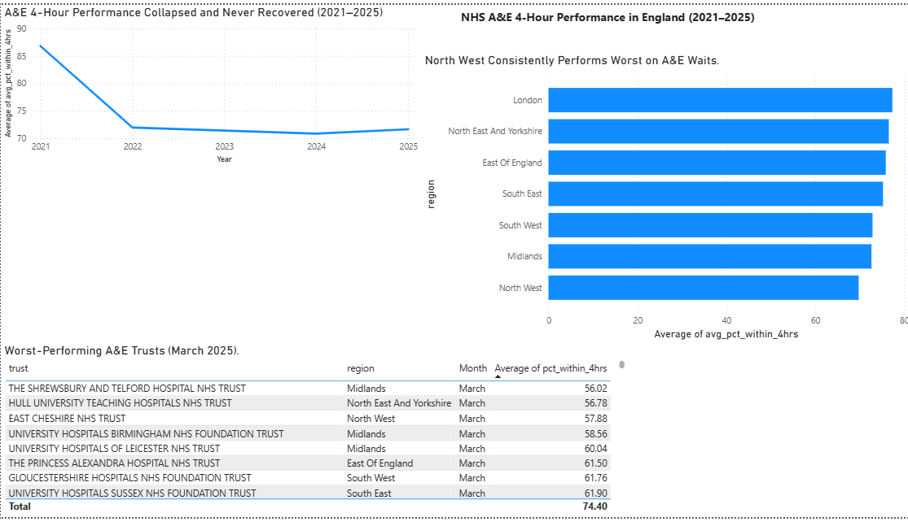

# NHS A&E Waiting Times Analysis (2021–2025)

An end-to-end data analysis of Accident & Emergency (A&E) four-hour waiting time performance across England's major A&E departments, using official NHS England data from 2021 to 2025.

**Tools used:** Python (pandas), SQL (SQLite, window functions), Power BI, Excel

---

## The Question

> **How have A&E four-hour waiting times varied across English regions since 2021, and which trusts consistently miss the four-hour target?**

The NHS operational standard is that **95% of A&E patients should be admitted, transferred, or discharged within four hours** of arrival. This project measures how far reality has drifted from that target, where the problem is worst, and how it has changed over time.

---

## Dashboard



---

## Key Findings

**1. Performance collapsed after 2021 and never recovered.**
Average four-hour performance for major A&E departments fell from **86.6% (March 2021)** to **71.7% (March 2022)** — a drop of roughly 15 percentage points — and has stayed flat at around **71%** every year since. The unusually high 2021 figure reflects COVID-era conditions, when A&E attendances were suppressed by lockdown; performance crashed as normal demand returned in 2022 and has plateaued well below target ever since.

**2. No region meets the target — and the gap between regions is wide.**
Every one of England's seven regions sits far below the 95% standard. The **North West** performed worst every year from 2021 to 2024, before the **South West** fell below it in 2025. By March 2025, **London** performed best at 76.1% against the South West's 67.9%, a gap of roughly 8 percentage points.

**3. The same trusts miss the target year after year.**
Seven trusts were in the national bottom fifth for four-hour performance in **all five years**. The five lowest, by five-year average:

| Trust | Region | 5-year average % within 4 hours |
|---|---|---|
| The Shrewsbury and Telford Hospital NHS Trust | Midlands | 56.0% |
| Hull University Teaching Hospitals NHS Trust | North East & Yorkshire | 56.8% |
| East Cheshire NHS Trust | North West | 57.9% |
| University Hospitals Birmingham NHS Foundation Trust | Midlands | 58.6% |
| University Hospitals of Leicester NHS Trust | Midlands | 60.0% |

In March 2025 alone, the lowest performers were East Cheshire (50.0%), Shrewsbury and Telford (52.5%) and Nottingham University Hospitals (53.0%).

**4. Weighting by patients barely changes the national picture.**
Counting every patient equally rather than every trust, national performance in March 2025 was **72.0%**, **23 percentage points below the 95% standard**. Some trusts look better overall than their major A&E departments really are: Hull's Type 1 performance was 41.3%, against 58.5% across all attendance types.

---

## Method

1. **Data collection** — Downloaded monthly A&E CSV files (March 2021–2025) from NHS England's official *A&E Attendances and Emergency Admissions* statistics.
2. **Cleaning (Python / pandas)** — Loaded each file, selected the relevant columns, and combined the three attendance types (Type 1 major A&E, Type 2, and Other) and their corresponding over-four-hour counts.
3. **Metric calculation** — The percentage within four hours is not provided in the raw data, so it was calculated directly:

   `% within 4 hours = (total attendances − attendances over 4 hours) ÷ total attendances × 100`

4. **Filtering** — Restricted the analysis to organisations with meaningful major A&E (Type 1) activity, so walk-in and urgent care centres do not distort the comparison. Removed NHS summary ("Total") rows that would otherwise be miscounted as a region.
5. **Reusable function** — Wrapped the cleaning logic in a function and applied it across all five yearly files, stacking them into one combined dataset of 623 trust-year records.
6. **Aggregation** — Grouped the data by year and by region to produce the national trend and regional comparison.
7. **SQL analysis (SQLite)** — Loaded the cleaned data into a database, ran data quality checks, and rebuilt the analysis in SQL. The SQL reproduces the Python trend and regional figures exactly, then extends them with patient-weighted averages, rankings (`RANK`), year-on-year change (`LAG`, `FIRST_VALUE`) and quintile analysis (`NTILE`) to identify trusts that consistently underperform.
8. **Visualisation (Power BI)** — Built a three-part dashboard: a national trend line, a regional comparison bar chart, and a ranked table of worst-performing trusts.

---

## Files in this Repository

| File | Description |
|---|---|
| `nhs_ae_analysis.ipynb` | The Python notebook: data cleaning, metric calculation, and aggregation |
| `ae_clean_all_years.csv` | Cleaned trust-level data, all years combined |
| `ae_trend_by_year.csv` | National four-hour performance by year |
| `ae_regional_by_year.csv` | Regional performance breakdown by year |
| `nhs_dashboard.png` | The final Power BI dashboard |
| `sql/` | SQL queries: schema, data quality checks, clean view and analysis |
| `nhs_ae_sql_analysis.ipynb` | Notebook running the SQL queries, with results and commentary |
| `run_sql_analysis.py` | Runs every SQL file and saves the results (Python standard library only) |
| `sql_outputs/` | CSV results of each SQL query |

---

## Notes and Limitations

- **March was chosen as a consistent comparison month** across all years, to avoid seasonal distortion (A&E performance varies significantly between winter and summer). Comparing the same month year-on-year isolates the underlying trend.
- The **2021 baseline is affected by the COVID-19 pandemic** and should be read as an atypical year rather than a "normal" benchmark.
- The Python analysis averages performance across trusts, treating each trust equally; the SQL analysis adds a patient-weighted view alongside it.
- **Data quality:** SQL checks found that four national "Total" summary rows remained in the cleaned file (the Python filter did not catch them) and that region names carried trailing spaces. The SQL clean view corrects both. The effect on results is small: averages are unchanged to one decimal place, but trust counts in the original exports are one higher in 2021, 2022, 2023 and 2025.

---

## What I'd Do Next

- **Add more months** to move from an annual snapshot to a full monthly time series, revealing seasonal (winter) pressure patterns.
- **Bring in the 12-hour wait data** already present in the source files, to analyse the most severe delays (patients waiting 12+ hours from decision-to-admit).
- **Join to population or deprivation data** by region to explore whether A&E performance correlates with wider socioeconomic factors.

---

## Running the SQL Analysis

```bash
python run_sql_analysis.py
```

Or open `nhs_ae_sql_analysis.ipynb`. The queries use standard SQL and run in SQLite; they also work in PostgreSQL with minimal changes.

---

## Data Source

NHS England — *A&E Attendances and Emergency Admissions* monthly statistics.
Publicly available at: https://www.england.nhs.uk/statistics/statistical-work-areas/ae-waiting-times-and-activity/

*This analysis uses open public data and is intended as a portfolio demonstration of data cleaning, analysis, and visualisation.*
